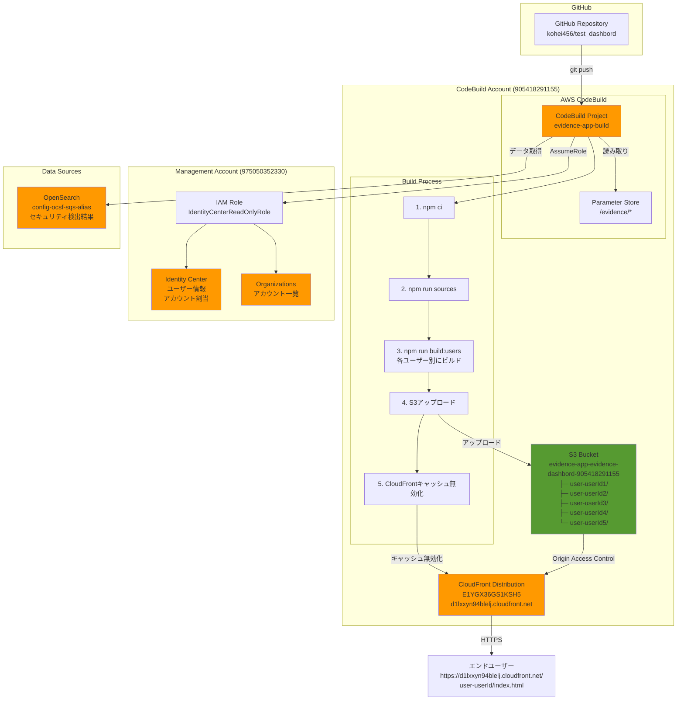
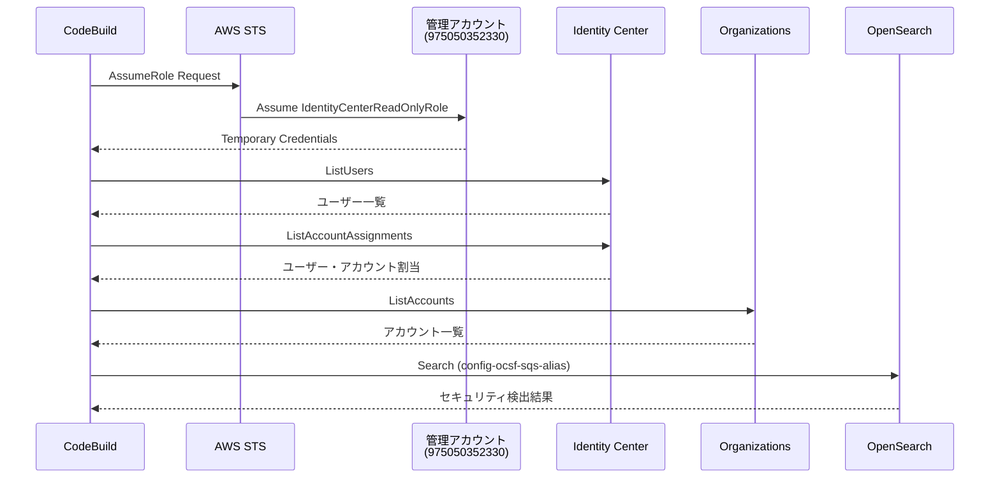
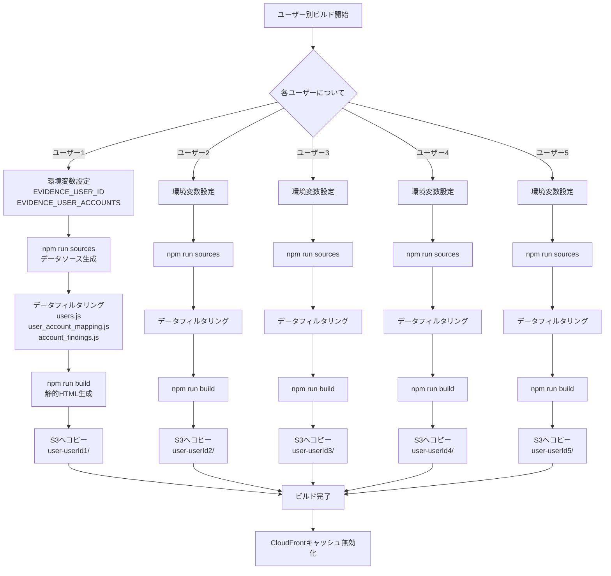
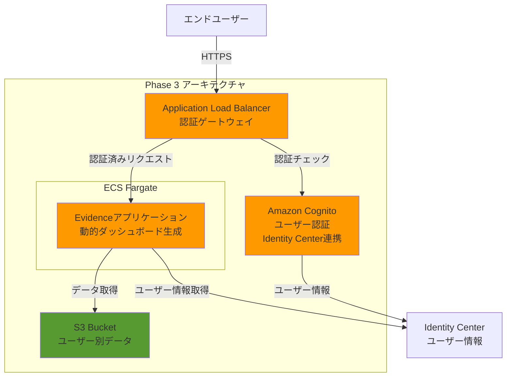

# Evidence ユーザー別ダッシュボード アーキテクチャ

## システム構成図



## データフロー

### ビルド時のデータ取得フロー



### ユーザー別ビルドフロー



## アカウント構成

### CodeBuildアカウント (905418291155)
- **リソース:**
  - CodeBuild プロジェクト: `evidence-app-build`
  - S3 バケット: `evidence-app-evidence-dashbord-905418291155`
  - CloudFront ディストリビューション: `E1YGX36GS1KSH5`
  - Parameter Store: `/evidence/*`

- **IAMロール:** `evidence-app-codebuild-role`
  - S3への読み書き権限
  - CloudFrontキャッシュ無効化権限
  - Parameter Store読み取り権限
  - 管理アカウントロールへのAssumeRole権限

### 管理アカウント (975050352330)
- **リソース:**
  - Identity Center
  - AWS Organizations

- **IAMロール:** `IdentityCenterReadOnlyRole`
  - Identity Center読み取り権限
  - Organizations読み取り権限
  - CodeBuildアカウントからのAssumeRoleを許可

## セキュリティ

### 認証・認可
- **現在 (Phase 2):**
  - URLを知っていれば誰でもアクセス可能
  - ユーザー別にデータはフィルタリング済み

- **将来 (Phase 3):**
  - ALB + Cognito + Fargate による認証
  - ユーザーは自分のダッシュボードのみアクセス可能

### データアクセス制御
- CodeBuildは管理アカウントのロールをAssumeして、Identity Center情報を取得
- 各ユーザーのダッシュボードには、そのユーザーがアクセス可能なアカウントのデータのみ含まれる
- OpenSearchデータはアカウントIDでフィルタリング

## ユーザー一覧

| ユーザー | ユーザーID | アカウント数 |
|---------|-----------|------------|
| securitylake-tic@serverworks.co.jp | 77649a08-10d1-7078-949d-bd8494e0e727 | 1 |
| org-tic@serverworks.co.jp | 7774dae8-a0a1-703c-0ccd-784e72d6239b | 0 |
| TIC-kasika@serverworks.co.jp | 97349a58-9011-70b7-88d6-a7a8913a53f8 | 1 |
| user-kuwahara-ryosuke | 97943a18-7031-7092-f256-e614c146f15d | 5 |
| member01-tic@serverworks.co.jp | 87441aa8-a0c1-70a7-ef07-35f97ededda9 | 1 |

## デプロイ方法

### 初回デプロイ
1. CloudFormationスタック作成
2. Parameter Store設定
3. 管理アカウントでIAMロール作成
4. CodeBuildビルド実行

### 更新デプロイ
1. コード変更をGitHubにプッシュ
2. CodeBuildビルドを手動実行
   ```bash
   aws codebuild start-build \
     --project-name evidence-app-build \
     --region ap-northeast-1
   ```

## 技術スタック

- **フロントエンド:** Evidence (Svelte ベース)
- **ビルド:** Node.js 18, npm
- **CI/CD:** AWS CodeBuild
- **ストレージ:** Amazon S3
- **CDN:** Amazon CloudFront
- **データソース:**
  - AWS Identity Center (ユーザー・アカウント情報)
  - AWS Organizations (アカウント一覧)
  - Amazon OpenSearch (セキュリティ検出結果)
- **認証情報管理:** AWS Systems Manager Parameter Store
- **クロスアカウントアクセス:** AWS STS AssumeRole

## 今後の拡張 (Phase 3)


